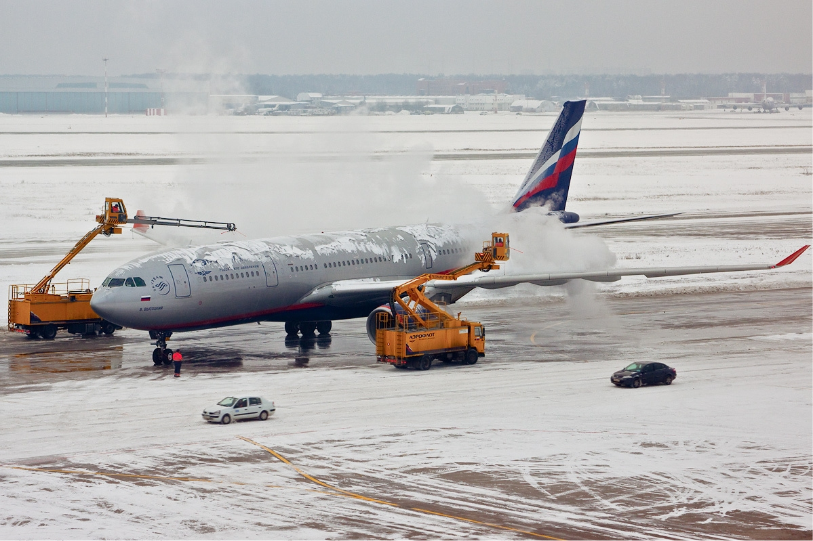
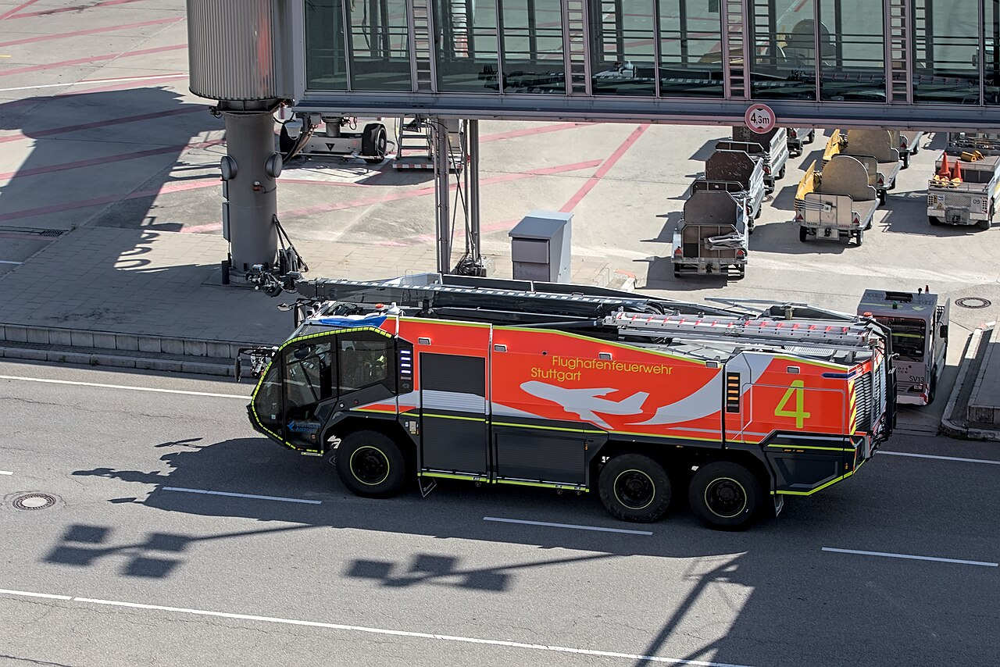

# ✈️ EPTA (Aviation English) Practice Test — Set 01

> Level 5/6(Expert) 목표 트레이닝용 모의고사입니다. 실제 시험처럼 문제지를 먼저 눈으로 읽고, 녹음 대신 즉흥적으로(문법을 고치거나 다시 쓰지 말고, 실제로 말하듯 한 번에) 아래 **- 내 답변:** 칸에 텍스트로 작성하세요.

---

## Part 1. ATC Communication & Situation Handling (Q1 - Q3)

### Q1. Emergency Situation Handling
> **[Scenario / ATC Readback]:**
> "Tower, November 123AB, experiencing severe engine vibration on engine #1 after takeoff. Requesting immediate return to the airport."

- **Question:** As the Pilot in Command, report your current situation, state your intentions to ATC, and request necessary ground assistance.
- **내 답변:**

---

### Q2. Weather Avoidance
- **Question:** Describe a time or scenario where unexpected convective weather (Cumulonimbus) blocks your assigned route. How would you request a detour from ATC using proper phraseology and plain English?
- **내 답변:**

---

### Q3. System Failure
- **Question:** You experience a total loss of hydraulic system pressure during descent. Explain your step-by-step checklist execution and communication with ATC/Company.
- **내 답변:**

---

## Part 2. Aviation Picture Description & Analysis (Q4 - Q5)

### Q4. Scenario Analysis A

> **[Context Hint]:** Aircraft ground operations / de-icing procedure scene at an airport gate or apron.

- **Question:**
  1) Describe what you see in the image in detail.
  2) What safety hazards could arise from this situation, and what measures should be taken?
- **내 답변:**

---

### Q5. Scenario Analysis B

> **[Context Hint]:** Airport emergency response / crash tender (ARFF) vehicles staged near the airfield.

- **Question:**
  1) Describe the situation shown in the picture.
  2) How does this condition affect flight safety and airport operational capacity?
- **내 답변:**

---

## Part 3. Aviation Discussion (Q6 - Q7)

### Q6. Human Factors & Automation
- **Question:** High levels of automation in modern glass cockpits reduce pilot workload, but can also lead to automation bias and loss of situational awareness. What is your opinion on maintaining manual flying skills versus relying on flight management systems?
- **내 답변:**

---

### Q7. Lithium Battery Regulations
- **Question:** Thermal runaway of lithium-ion batteries poses a critical fire hazard in cargo holds and passenger cabins. Discuss how airlines and regulatory bodies (ICAO/FAA) should address this risk effectively.
- **내 답변:**

---

## 📝 채점 및 오답노트 안내

1. 위의 **- 내 답변:** 칸에 실전처럼 즉흥적으로 텍스트를 작성하세요 (문법을 고치거나 다시 쓰지 말고, 실제로 말하듯 한 번에 작성하는 것을 추천합니다).
2. 모든 문제(Q1~Q7)를 다 작성한 뒤, 이 파일 전체(또는 답변 부분만)를 저에게 보내주시면:
   - ICAO EPTA 6대 평가 항목(Pronunciation / Structure / Vocabulary / Fluency / Comprehension / Interactions) 기준 **정밀 채점**
   - **오답노트**: 반복되는 문법 실수, 어색한 표현, 더 고급스러운 대체 표현 제안
   - **모범답안 예시** (Level 6 스타일) 제공
3. 정답 제출은 `epta_practice_01_answers.md` 파일을 사용하셔도 됩니다 (질문 없이 답변만 정리된 제출 전용 양식).
