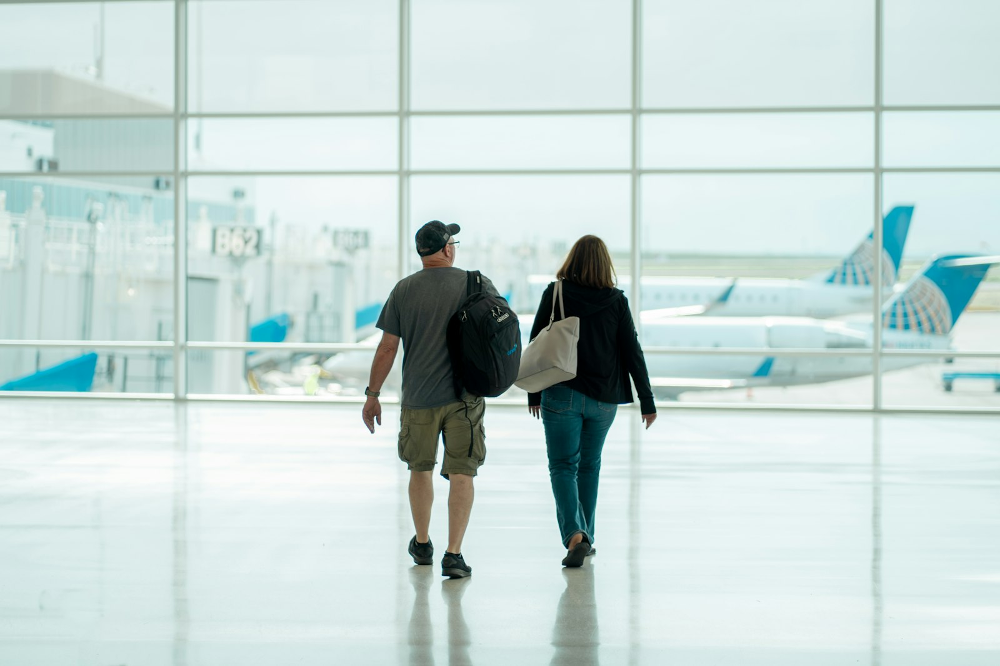

# 🗣️ TOEIC Speaking Practice Test (Q3 ~ Q11) — Set 04

> AL(160-200) 목표 트레이닝용 모의고사입니다. 실제 시험처럼 문제지를 먼저 눈으로 읽고, 준비 시간을 스스로 재면서(Q3-Q4: 45초 준비/45초 답변, Q5-Q7: 준비 없이 15초/15초/30초, Q8-Q10: 45초 준비 후 15초/15초/30초, Q11: 45초 준비/60초 답변) 아래 **- 내 답변:** 칸에 텍스트로 작성하세요.
>
> **이번 세트는 Part 4 유형을 바꿨습니다.** 지금까지는 계속 "시간표 + 시간 겹침 계산" 패턴이었는데, 이번엔 **시간이 아니라 조건(가격/인원/거리)을 비교해서 고르는 표**입니다. Q10도 "몇 시에 겹치나"가 아니라 "여러 조건을 동시에 만족하는 항목 찾기"로 완전히 다른 방식입니다 — 표 전체를 다 훑어야 정답이 나옵니다.
>
> **계속 챙길 것:** Q7은 여전히 두 갈래 질문입니다 — 의견 다음에 꼭 `As for advice, ...`를 붙여보세요.

---

## Part 2. Describe a Picture (Q3 - Q4)

### Q3. Describe a picture in detail.

> **[Context Hint]:** A man and a woman are walking away from the camera through a large airport terminal with big glass windows, carrying a backpack and a bag, with airplanes visible on the tarmac outside.

- **내 답변:**
This picture was taken at an airport. i can see 2people, who seem to be walking and chatting , i think they are looking at the background, in the background there are 2 airplanes, they are parked in a row. overal it looks like a typical airport scene.
---

### Q4. Describe a picture in detail.

> **[Context Hint]:** A waiter is serving a plate of pizza to three customers sitting at a wooden table in a café-style restaurant, with a French press coffee pot and cups also on the table.

- **내 답변:**
This pickture was taken at a restaurant. i can see 4people. 3 of them seem to be clinets. they are looking at a food. on the right side , i can see 1 poeple who seems to be a server. he seesm to be giving a food to them. on the table , there are some items in the background. i can see some items displayed on the sheles overal it looks like a typical restaurant.

---

## Part 3. Respond to Questions (Q5 - Q7)

**Scenario:** Imagine that an American travel research firm is conducting a telephone survey about **vacation and travel habits**. You have agreed to participate in the survey.

### Q5. How often do you travel for leisure each year, and where do you usually like to go?

- **내 답변:**
i travel for leisure for twice a year, and i usually go to jeju island. there a lots of to do lesure things.
### Q6. What do you think is the most important factor when choosing a vacation destination?

- **내 답변:**
in my case, price is the most important factor when choosing a vacation destination. because i'm student so i want to go something reasonable place.
### Q7. Some people believe travel agencies are becoming unnecessary now that people can book flights and hotels online themselves. **First**, what is your opinion of this trend? **Second**, what advice would you give to a travel agency that wants to stay competitive?

- **내 답변:**
first , i think people book lfight and hotels online themselves is better than using travel agencies . because the travel agencies get some extra fees to serve their services to reserve the flight and accomodations. and seceont for my advice , i think travel agencies have to get some feedback from the travelers who experience their services and make it better than before. 
---

## Part 4. Respond to Questions Using Information Provided (Q8 - Q10)

**Situation:** You are helping your company choose a venue for the annual company retreat. Your manager calls you with some questions about the options.

### Company Retreat Venue Options

| Venue                | Price / Person | Capacity | Included Activities              | Distance from Office |
|-----------------------|------------------|------------|-------------------------------------|-------------------------|
| Lakeside Lodge        | $65              | 40 people  | Kayaking, BBQ dinner                | 45 minutes              |
| Mountain View Resort  | $95              | 80 people  | Hiking, spa access, BBQ dinner       | 1.5 hours               |
| Riverside Hall        | $75              | 60 people  | Cooking class, live music           | 30 minutes              |
| Green Valley Retreat  | $55              | 30 people  | Yoga session, BBQ dinner            | 20 minutes              |

### Q8. What is the price per person at Lakeside Lodge, and how many people can it hold?

- **내 답변:**
it takes 65dollars per person , and it can hold 40.
### Q9. I heard Riverside Hall has some included activities. What are they, and how far is it from the office?

- **내 답변:**
yes that's right , they have some activities about cooking class and live music, it takes 30minutes to go.
### Q10. My manager wants a venue that can hold at least 50 people and costs under $80 per person. Which venue should I choose, and why?

- **내 답변:**
in this case, i would recoment riverside hall , it can hold 60 people and it takes only 75 dollars, and it has cooking class and live music activities. also it takes only 30 minutes to go.
---

## Part 5. Express an Opinion (Q11)

### Q11. Some people believe cities should invest more in public transportation, while others believe funding should focus on roads and infrastructure for cars. Which do you think is a better use of public funds, and why?

- **내 답변:**
I think investing more in publick transportation is better than funding on roads and infrascturcture for cars. there are some reasons that support my opionion,. first recently economy has dropped ,as few people can buy cars. second it takes more time to fix road infrastructure than transportation infrascturcture . last it pollutes if more cars on the road . so i think this is why i prefer investing more in public transportation.
---

## 📝 채점 및 오답노트 안내

1. 위의 **- 내 답변:** 칸에 실전처럼 즉흥적으로 텍스트를 작성하세요 (빠르게 타이핑하며 생기는 오타/쉼표는 채점에서 제외되니 신경 쓰지 마세요).
2. 다 작성한 뒤 이 파일을 저에게 보내주시면, **내 원문 → 교정 문장 → 무엇이 바뀌었는지** 형식으로 문장 단위 피드백과 오답노트를 드리겠습니다. (이미 맞는 표현은 안 바꾸고, 대안 표현이 있으면 별도로 참고용으로만 덧붙입니다.)
